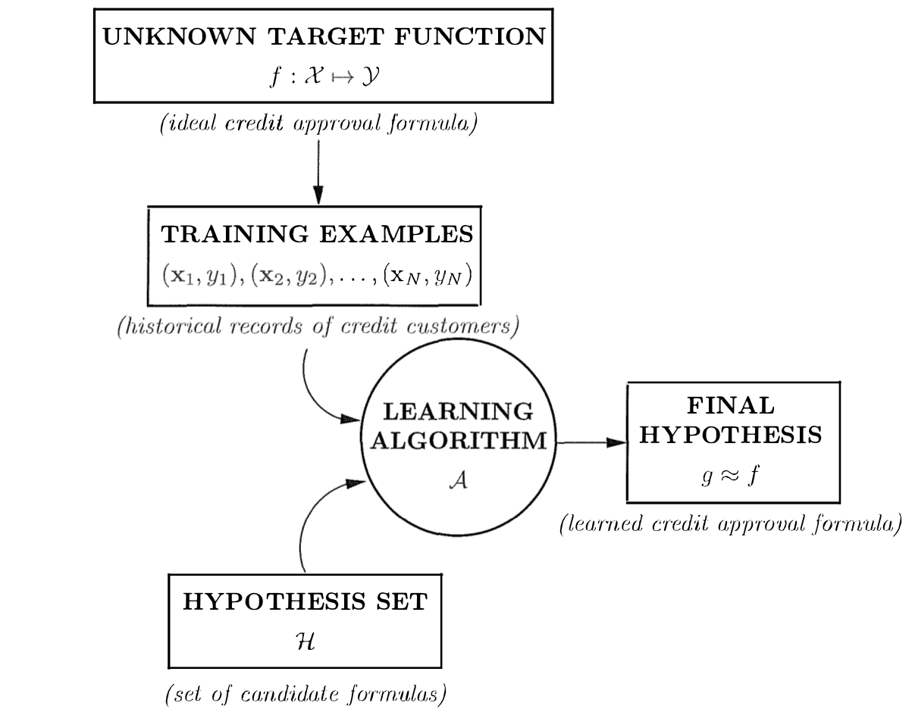

# Learning From Data

The figure below demonstrates the learning problem in the case of credit card approval system. 

Given dataset X, the training algorithm chooses from the hypothesis space H, a function g that approximates the unknown function $f : X \rightarrow Y$, which maps input X to output Y.

In case of the Credit Card Approval problem, we have $X \epsilon R^{d}$ as the input vector, which is a combination of various user information. $h(x)$ is the hypothesis, a weighted sum of inputs, which provides the credit score. The request is approved if the credit score is greater than a threshold. This threshold can be written as $b = -threshold$.

$h(x) = sign( ( \sum_{i} w_{i}X_{i} )+ b )$

The weight update rule given by Perceptron Learning Algorithm (PLA) is 

$w(t+1) = w(t) + x(t)y(t)$

## Learning by design

Consider the problem of classifying coins based on their denomination. The design approach estimates the relative probability of a particular denomination of a coin given its size and mass. It basically learns a joint probability distribution of all denominations and then a decision rule is constructed to classify the denominations. Read more on [[2](https://www.byclb.com/TR/Tutorials/neural_networks/ch4_1.htm)].

## Types of Learning

> **The basic premise of learning from data is the use of a set of observations to uncover an underlying process.**

## Terms

* Learning Model : learning algorithm and hypothesis space
* Active Learning
* Online Learning

## Reference

> 1. [Abu Mostafa](http://amlbook.com/)
> 2. [Bayes Decision Theory](https://www.byclb.com/TR/Tutorials/neural_networks/ch4_1.htm)
